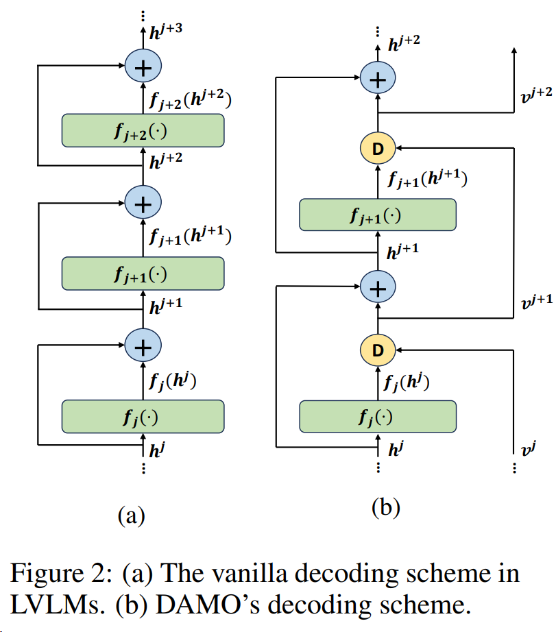

# DAMO: Decoding by Accumulating Activations Momentum for Mitigating Hallucinations in Vision-Language Models (ICLR 2025)

## Introduction
This papers aims to mitigate hallucinations in Vision-Language Models (VLMs) by accumulating visual information from earlier layers, where we found that correct information often appears in the early stage. By refining activations throughout the inference procedure, DAMO effectively preserves essential visual semantics, leading to more accurate and reliable predictions.

Here is the paper link: https://openreview.net/forum?id=JUr0YOMvZA

<br/>

## Usage (Taking LLaVA1.5 as an example)

1) Please create the llava 1.5 env from official repo:
   ```
   https://github.com/haotian-liu/LLaVA.git
   ```
2) Please replace the `LLaVA/llava/model/language_model/llava_llama.py` with ours. 
3) Please replace the `LLaVA/llava/model/llava_arch.py` with ours. 
4) Please replace the `LLaVA/llava/eval/run_llava.py` with ours.
5) Then, for MME benchmark, you could run `CUDA_VISIBLE_DEVICES=0 python llava_mme.py --output_dir DAMO` to evaluate MME benchmark.
## Citation
```
@inproceedings{wangdamo,
  title={DAMO: Decoding by Accumulating Activations Momentum for Mitigating Hallucinations in Vision-Language Models},
  author={Wang, Kaishen and Gu, Hengrui and Gao, Meijun and Zhou, Kaixiong},
  booktitle={The Thirteenth International Conference on Learning Representations}
}
```
